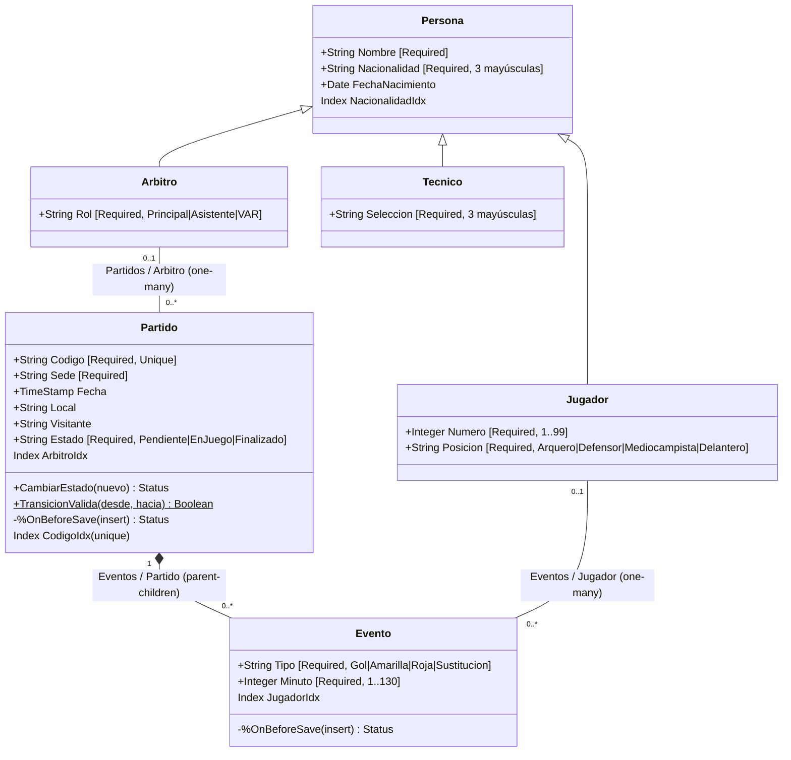

# Hito 9 — Entidades complejas del Fixture 2030 (InterSystems IRIS)

**Repositorio del grupo:** https://github.com/juancruzzolezzi/fixture2030-grupo7
**Asignatura:** Ingeniería de Datos II — Grupo 7
**Tecnología:** InterSystems IRIS Community (base orientada a objetos / multimodelo) con Docker Compose

En el Hito 2 las **entidades complejas** quedaron asignadas al modelo orientado a
objetos (IRIS). Este módulo implementa esa porción del dominio: el **Partido** como
máquina de estados, sus **Eventos** inalterables, y las **personas** que participan
(jugadores, árbitros, técnicos). Toda la integridad vive en las clases, sin ORM ni
middleware.

## Estructura

```
fixture2030-iris/
docker-compose.yml                  IRIS Community (imagen oficial), Durable %SYS en ~/docker/data/iris
docker-compose.windows.yml          Ajustes para Docker Desktop en Windows (ver sección 3)
scripts/
  Fixture/                          Código fuente del dominio (un .cls por clase)
    Persona.cls                     Clase base persistente
    Jugador.cls  Arbitro.cls  Tecnico.cls   Subclases de Persona
    Partido.cls                     Máquina de estados + padre de Evento
    Evento.cls                      Hijo de Partido, inalterable
    Demo.cls                        Demostración completa: Do ##class(Fixture.Demo).Ejecutar()
  demo_crud_iris_fixture2030.mac    Bloques para copiar/pegar en vivo en el Terminal
  cargar.sh / compilar.txt          Compilan las clases dentro del contenedor (Linux/macOS / cualquier SO)
  demo.sh / demo.txt                Corren la demo completa (Linux/macOS / cualquier SO)
  capturas/                         Una parte de la demo por archivo (usados para las capturas)
docs/evidencia/                     Salidas .txt y capturas .png de la corrida real
```

## 1. Diagrama de objetos



Todas las relaciones son **bidireccionales** (`Relationship` con `Inverse`): si se
asigna `evento.Jugador = j`, IRIS agrega el evento a `j.Eventos` automáticamente.

**Máquina de estados del Partido:** `Pendiente → EnJuego → Finalizado`. No se puede
saltear un paso ni retroceder. Un partido nuevo nace siempre `Pendiente`.

## 2. Matriz de integridad

| Regla | Dónde se garantiza | Qué pasa si se viola |
|---|---|---|
| Campos obligatorios y tipos estrictos (dorsal 1–99, posición de una lista, nacionalidad de 3 mayúsculas, minuto 1–130) | `[Required]`, `MINVAL/MAXVAL`, `VALUELIST`, `PATTERN` en cada propiedad | `%Save()` devuelve un error y no se guarda nada |
| Un evento no existe sin su partido | Relación `parent/children` | No se puede guardar un `Evento` sin `Partido` |
| **Si se borra un partido, se borran sus eventos** | `parent/children` (borrado en cascada por defecto) | Los eventos desaparecen junto con el partido |
| No se puede borrar un jugador que tiene eventos | Relación `one/many` (por defecto, sin acción en cascada) | `%DeleteId` del jugador es rechazado |
| No se puede borrar un árbitro que dirige partidos | Relación `one/many` | `%DeleteId` del árbitro es rechazado |
| Un árbol padre + hijos se guarda entero o no se guarda | `%Save()` del padre corre en una transacción | Si un evento es inválido, tampoco se guarda el partido |
| Código de partido único | `Index CodigoIdx [Unique]` | Segundo partido con el mismo código es rechazado |
| El estado solo avanza `Pendiente → EnJuego → Finalizado` | `Partido.CambiarEstado()` + `Partido.%OnBeforeSave` (compara contra el valor guardado en disco) | Transición rechazada, aunque se modifique `Estado` a mano |
| Un partido Finalizado no admite eventos nuevos | `Evento.%OnBeforeSave` | Guardado rechazado (cubre el caso "evento en el minuto 0 a un partido Finalizado") |
| Los eventos registrados no se modifican | `Evento.%OnBeforeSave` (solo acepta inserciones) | Cualquier cambio a un evento guardado es rechazado |
| El árbitro de un partido debe ser Principal | `Partido.%OnBeforeSave` | Asignar un árbitro VAR o Asistente es rechazado |

### Índices y por qué están

- **`Evento.JugadorIdx`** y **`Partido.ArbitroIdx`** (lado "muchos" de cada relación
  uno-a-muchos, RNF3). Para cargar `jugador.Eventos`, IRIS busca qué eventos apuntan
  a ese jugador; sin índice recorre todos los eventos. Los mismos índices hacen
  barato el control de integridad al borrar un jugador o un árbitro.
- **Eventos dentro del partido:** en la relación padre-hijo los eventos se guardan
  físicamente *dentro* del nodo del partido (su ID es `idPartido||n`), así que la
  propia estructura de almacenamiento ya funciona como índice: cargar
  `partido.Eventos` lee solo ese nodo, sin recorrer los demás.
- **`Partido.CodigoIdx`** (único) y **`Persona.NacionalidadIdx`**: soportan las
  búsquedas por código de partido y la consulta por nacionalidad de la demo.

### Decisiones de modelado

- **Herencia solo para tipos que no cambian.** Jugador, Árbitro y Técnico son
  subclases de Persona; el estado de un partido (o de un jugador) es una propiedad,
  no una subclase. Por eso no existe `PartidoFinalizado` ni `JugadorLesionado`.
- **Enlace con el módulo documental (Hito 4):** `Nacionalidad`, `Local`,
  `Visitante` y `Seleccion` usan el código FIFA de 3 letras, que es el `_id` de los
  equipos en MongoDB.
- **Un archivo `.cls` por clase:** el formato `.cls` de IRIS contiene una sola
  clase por archivo, por eso se compila la carpeta completa con `LoadDir` en lugar
  de un único `Fixture.Clases.cls`.

## 3. Operativa

Todos los comandos se ejecutan **desde la carpeta `fixture2030-iris/`**.

### Requisitos

Docker Desktop (o Docker Engine + Compose).

### Levantar IRIS en Windows (Docker Desktop, PowerShell)

La configuración oficial monta `~/docker/data/iris` como carpeta del disco. En
Windows eso no funciona para Durable %SYS: IRIS necesita cambiar el dueño de esa
carpeta (`chown`) y Windows no lo permite, así que el contenedor no arranca
(`Error executing chown irisowner:irisowner /durable/`). Además, Windows suele
reservar el rango de puertos donde cae el 52773. `docker-compose.windows.yml`
resuelve las dos cosas sin tocar el compose oficial:

- `/durable` pasa a ser un **volumen administrado por Docker** (`iris-durable`),
  que sobrevive a reinicios y a `docker compose down`. Un servicio `iris-init`
  (la misma imagen, corre una vez y termina) le asigna el dueño `irisowner`.
- El Portal de Administración queda en **http://localhost:9092/csp/sys/UtilHome.csp**.

```powershell
docker compose -f docker-compose.yml -f docker-compose.windows.yml up -d
docker compose -f docker-compose.yml -f docker-compose.windows.yml ps   # esperar "healthy"
```

Compilar y correr la demo (los `.txt` evitan problemas de comillas de PowerShell):

```powershell
docker exec -i fixture2030-iris sh -c "iris session IRIS -U USER < /scripts/compilar.txt"
docker exec -i fixture2030-iris sh -c "iris session IRIS -U USER < /scripts/demo.txt"
```

Para borrar todo y empezar de cero: `docker compose -f docker-compose.yml -f docker-compose.windows.yml down -v`.

### Levantar IRIS en Linux / macOS / WSL

```bash
mkdir -p ~/docker/data/iris
sudo chown -R "$(id -u):$(id -g)" ~/docker/data/iris
sudo chmod -R 777 ~/docker/data/iris
docker compose up -d
docker compose ps            # esperar "healthy"
```

### Cargar y compilar las clases

Opción A, desde el Terminal de IRIS:

```bash
docker exec -it fixture2030-iris iris session IRIS
```
```objectscript
Do $system.OBJ.LoadDir("/scripts/Fixture","ck")
```

Opción B, un solo comando desde el host: `./scripts/cargar.sh`

Al final de la compilación IRIS informa las tablas SQL creadas
(`Fixture.Persona`, `Fixture.Jugador`, `Fixture.Arbitro`, `Fixture.Tecnico`,
`Fixture.Partido`, `Fixture.Evento`).

### Demostración

Completa (todas las pruebas, cada una marcada como `(esperado)` o `(INESPERADO!)`):

```objectscript
Do ##class(Fixture.Demo).Ejecutar()
```

o desde el host, guardando la salida: `./scripts/demo.sh` → `docs/evidencia/salida_demo_completa.txt`.

| Sección de la demo | Qué demuestra | Requisito |
|---|---|---|
| 1. Herencia | Jugador, Árbitro y Técnico se guardan en el mismo extent de Persona | RF4 |
| 2. Árbol padre-hijo | Partido + 2 eventos guardados con un solo `p.%Save()`; los IDs aparecen recién después del guardado | RF3, RF6 |
| 3. Falla controlada | Jugador sin `Numero`, con dorsal 150, con nacionalidad "Argentina": rechazados | RF5 |
| 4. Atomicidad | Un evento inválido cancela el guardado del partido completo | RF6 |
| 5. Máquina de estados | Avances válidos aceptados; saltear o retroceder, rechazado | RF9 |
| 6. Eventos ilegales | Evento en el minuto 0 a un partido Finalizado: rechazado. IRIS valida primero los tipos (`MINVAL`) y después `%OnBeforeSave`, por eso este caso lo frena el minuto; el de minuto 50 muestra la regla de partido Finalizado | RF9 |
| 7. Inalterabilidad | Modificar un evento ya guardado: rechazado | RF9 |
| 8. Navegación | Partido → árbitro → eventos → jugador, y jugador → eventos → partido, sin SQL | RF7 |
| 9. Proyección SQL | Los mismos objetos consultados con `SELECT` (incluye joins implícitos con `->`) | RF8 |
| 10. Integridad al borrar | Jugador/árbitro referenciados: rechazado. Partido: borra sus eventos en cascada | Matriz |

Para mostrar en vivo paso a paso, copiar los bloques de
`scripts/demo_crud_iris_fixture2030.mac` en el Terminal (incluye los del instructivo
de la clase más la falla por `[Required]` y las transiciones ilegales). Si un
`%Save()` falla, `Do $System.Status.DisplayError(sc)` muestra el motivo.

Para salir del Terminal: `Halt`. Para bajar el ambiente sin perder datos:
`docker compose down`.

## 4. Trazabilidad con la consigna

| Requisito | Cómo se cumple |
|---|---|
| RF1 / RNF1 | `docker-compose.yml` oficial (`intersystems/iris-community:latest-cd`), Durable %SYS en `~/docker/data/iris` |
| RF2 | Seis clases persistentes: Persona, Jugador, Arbitro, Tecnico, Partido, Evento |
| RF3 | `Partido.Eventos` ↔ `Evento.Partido` (parent/children), más dos relaciones one/many |
| RF4 | Jugador, Arbitro y Tecnico extienden Persona |
| RF5 | `[Required]` y tipos con restricciones en todas las clases |
| RF6 | `Fixture.Demo.ArbolPadreHijo` y bloque 3 del `.mac` |
| RF7 | `Fixture.Demo.Navegacion` y bloque 5 del `.mac` |
| RF8 | `Fixture.Demo.ProyeccionSQL` y bloque 4 del `.mac` |
| RF9 | `Partido.CambiarEstado`, `Partido.%OnBeforeSave`, `Evento.%OnBeforeSave` |
| RNF2 | Las clases compilan con `LoadDir(...,"ck")`; solo dependen de clases del sistema (`%Persistent`, `%SQL.Statement`) |
| RNF3 | `Evento.JugadorIdx`, `Partido.ArbitroIdx` |
| RNF4 | Todo el dominio en archivos `.cls`, invocable desde el Terminal |
| RNF5 | Este repositorio; `.gitignore` excluye datos de IRIS |

## 5. Evidencia de ejecución

Corrida real sobre IRIS Community en Docker Desktop (Windows), 08/10/2026:

- `docs/evidencia/salida_compilacion.txt`: las 7 clases y las 6 tablas SQL compilan sin errores.
- `docs/evidencia/salida_demo_completa.txt`: las 26 verificaciones de la demo dan `(esperado)`,
  ninguna `(INESPERADO!)`.
- `docs/evidencia/salida_bloques_mac.txt`: los bloques de `demo_crud_iris_fixture2030.mac`
  ejecutados en orden.

- 8 capturas del Terminal (`01_contenedor.png` a `08_integridad_al_borrar.png`), una por grupo de
  requisitos.

El detalle de cada archivo está en `docs/evidencia/LEEME.md`.
